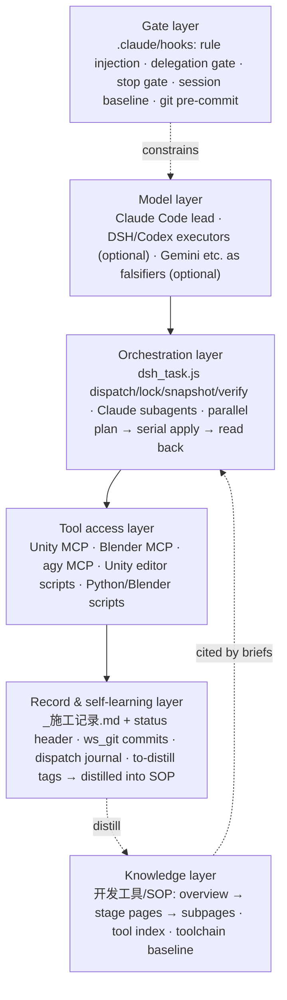

# vrc-avatar-agent-kit

A VRChat avatar customization workflow where Claude Code leads, subagents execute, hooks enforce the rules, and the SOP learns from its own mistakes.

[中文 → README.md](README.md)

## What this is

The public export of a working commission workspace: a client sends an asset bundle, and agents do the face shaping, colorways, outfit and accessory fitting, menus and animator layers, regression testing, performance optimization and delivery packaging in Unity/Blender. This repository holds the parts that make that repeatable:

- **Division of labor**: Claude Code is the lead (process control, aesthetic judgment, fallback, SOP maintenance, acceptance); execution goes to subagents (DSH / Codex, optional; otherwise Claude subagents).
- **Gates**: Claude Code hooks inject 8 mandatory rules every turn, block the lead from editing projects directly, and check the work log, falsification and question style before a turn may end.
- **Procedures (SOP)**: one page per stage with a deterministic step table and machine-checkable pass criteria, details in subpages; criteria for mesh edits, blendshapes, accessories, menus, regression, optimization and delivery.
- **Self-learning**: walls hit during execution are tagged on the spot; at the end of a phase a clean-context agent distills the tags back into the SOP in place.
- **Tools**: Unity editor scripts, Blender/Python scripts, dispatch and falsification scripts, MCP servers.

## A note from the author

Hi, I'm Nymiro.

To be upfront: this is an experimental project, and so far its return on investment is still low. For high-end avatar editing work I'm still burning tokens to find where the limits are, and I have to keep learning to keep up. Within the limits I've mapped out, though, it does produce models fairly efficiently, at a cost I personally consider reasonable.

Rather than a push-button "fully automatic avatar editor", what I'm sharing here is mostly a structured way of working. I use it myself to keep raising the quality and speed of my output, and I'll keep updating this repository.

A fair warning: the learning curve is steep. Early on you may need a lot of manual intervention to correct things, but it gets smoother the longer you use it — every wall you hit during a job is tagged "to-distill" in the work log, and at the end of each phase an agent with no chat history folds those notes back into the SOP, keeping overturned conclusions as counter-examples.

If you find it useful and run into problems outside these limits, please open an issue. And if you've worked out material that covers them, I'd really love to see it contributed back to this repository.

I'm also considering building a TUI harness. Enough feedback will push me to get it done sooner.

You're welcome to join the QQ group: **527190229**.

### What it can do today (conservative)

Prerequisites: Unity 2022.3.22f1 with frozen plugin versions; the face-sculpting and blend-shape tools depend on Blender. Claude Code alone is the minimum; DSH / Codex / agy are optional but need their own accounts or credit. Every tier below has to be re-calibrated for your own base avatars and plugin versions.

**Fairly reliable** (written criteria, tooling and acceptance checks)

- Order intake: picking packages, checking compatibility by in-package paths, estimating parameter and PhysBone headroom
- Asset import: unpacking, GUID checks, freezing and verifying toolchain versions
- Face-sculpt finalization: baking, eye-close compensation, export and binary self-checks — all numeric criteria
- Outfit fitting judged by bones; accessory poses computed geometrically with offset and angle thresholds
- Menus: ≤256 parameter bits, ≤8 controls per page, a menu generator, reading the menu tree without opening Unity
- Delivery: cold-import compile and compiled-menu assertions; passing the tools is necessary but not sufficient — a second-perspective review is still required

**Doable, but needs a human watching or judging taste**

- Reading reference images: several models describe them independently; a description is not a sculpting plan
- Settling the face shape: the machine proposes candidates, a human decides (hard gate)
- Recoloring: an aesthetic gate with multi-model review; disagreements go to a human
- Visual judgement: vision models are only reliable for "is it there or not" — not precise color picking, counting or alignment
- Squeezing PhysBones under 256: there is a procedure, but it has been used in practice only once
- Installing face tracking, some plugin GUIs, Unity panel operations and SDK uploads must be done by hand

**Not there yet / still exploring**

- Fitting outfits to body and foot blend shapes: not done well in any project so far; the related workflow is kept as samples only
- Regression testing: the old version passed everything and was then overturned; the new one has no accepted general workflow yet
- The perception mechanism (declaration reconciliation) is not yet part of the per-order routine, and some thresholds are uncalibrated
- No free-form vertex editing by AI: letting a model move the mesh directly produced non-human shapes in testing, so only vendor blend-shape values may be adjusted
- Modeling accessories from scratch: still being explored, not yet captured in the SOP

## Architecture



Components, file locations and design rationale for each layer: [docs/en/architecture.md](docs/en/architecture.md).

## Methods worth reading

The SOP pages are in Chinese; English translations live under [`en/`](en/dev-tools/sop/00-overview.md).

- **Once you have restated a conclusion twice, send it to another model to falsify.** Restating does not raise accuracy, only confidence; the self-check is whether the last falsification call's input was *your conclusion*. → [05 · Multi-model review](en/dev-tools/sop/05-multi-model-review.md)
- **The criterion itself can be broken.** Before reporting "X had no effect", check the observation moment, the measurement basis, and whether the checker has a bug; "zero" and "identical" do not mean "pass". → [The criterion may be broken](en/dev-tools/sop/troubleshooting/observation-criteria/criterion-may-be-broken.md)
- **Classify a conflict with one question: can the user turn B back on afterwards?** Yes → change B's parameter with a Driver on switch. No, suppress only while A is on → a separate layer writing the property. Same-slot exclusion → a priority chain, suppress one direction only. → [03 · Fitting and conflicts](en/dev-tools/sop/03-assembly-and-conflict-rules.md)
- **Accessory poses are computed, not typed in.** Humanoid bone local axes are whatever the base author chose; hand-typed Euler angles mean eight different sets for eight fingers. Solve for hole axis, center, inner radius and roll. → [55 · Accessory placement](en/dev-tools/sop/55-accessory-placement.md)
- **256 PhysBones is a hard build-time limit, not a rating.** It is a constant in the SDK validation; over it you cannot upload, and merging siblings alone will not get you there. → [Getting PhysBones under 256](en/dev-tools/sop/80-performance-optimization/compressing-physbone-to-256.md)
- **When adding blendshapes to clothing, Unity `BakeMesh` is the ground truth.** A Blender round trip can check out at 0 mm and still land 71 mm off in Unity; adding the frame to a copy of the original mesh inside Unity keeps geometry and bindposes bit-identical. → [Adding blendshapes to clothing](en/dev-tools/sop/50-outfit-and-hair-assembly/adding-blend-shapes-to-clothing.md)
- **Plan in parallel, apply serially, read back immediately.** The parallelism boundary is the single Unity instance, not the dependency graph; tools come as paired "plan / apply" entry points. → [01 · Automation and parallelism](en/dev-tools/sop/01-automation-and-parallelism.md)
- **Record symptoms on the spot, distill rules at the end.** Editing the SOP from a tired context produces cross-page contradictions, while after-the-fact notes get rationalized, so the two are split. → [End-of-phase distillation and status header](en/dev-tools/sop/04-build-log-and-version-control/wrapup-distillation-and-status-header.md)

## Quick start

Three tiers, depending on what you have:

| Tier | Requires | You get |
|---|---|---|
| Minimal | Claude Code | Hook-enforced rules + SOP criteria + work logs; execution by Claude subagents |
| Intermediate | + agy (Gemini etc., via `agy_panel.py` / `agy_mcp_server.js`) | Third-party falsification of conclusions |
| Full | + DSH and/or Codex CLI | `dsh_task.js` orchestration, time-based engine selection, session-log verification |

> ⚠ **The hooks assume the Full tier by default**: `delegate-check.js` only resets its "direct edit" counter after a `dsh_task.js` run (it blocks from the 3rd edit), and `stop-gate.js` only counts agy calls as falsification.
> With Claude Code alone, declare an exemption before editing — `node .claude/hooks/delegate-check.js --exempt 用户确认 "<reason>"` (valid 20 min; the category names are Chinese literals) — or adapt the two hooks to your own setup. See [fallback options](docs/en/architecture.md).

Steps:

```bash
git clone https://github.com/Bai-Mirror/vrc-avatar-agent-kit.git
cd vrc-avatar-agent-kit
cp kit.env.example kit.env                                # local paths: workspace, Unity install root, asset library, archive, ...
cp .claude/settings.example.json .claude/settings.json    # wire the hooks (5 events, 4 scripts)
cp .mcp.example.json .mcp.json                            # keep the Unity / Blender / agy MCP entries you need
git config core.hooksPath 开发工具/通用工具/git-hooks      # commit gate: blocks large files and likely secrets
```

Then adapt [CLAUDE.md](CLAUDE.md) (a template; leave the two rule-marker lines alone — [CLAUDE.en.md](CLAUDE.en.md) is a read-only English reference), open the repository in Claude Code, and start at `开发工具/SOP/00_总表.md`. Replication checklist and fallbacks without DSH/Codex/agy: [docs/en/architecture.md](docs/en/architecture.md).

## Layout

| Path | Contents |
|---|---|
| [CLAUDE.md](CLAUDE.md) | Lead-agent workspace template, including the hook-injected rules |
| [.claude/hooks/](.claude/hooks/) | 4 Claude Code hooks: `rules-inject.js` `delegate-check.js` `stop-gate.js` `session-start.js` |
| [开发工具/SOP/](en/dev-tools/sop/) | The canonical procedures (Chinese); start at `00_总表.md` |
| [开发工具/通用工具/](开发工具/通用工具/) | Scripts and editor tools; `git-hooks/` is the commit gate |
| [开发工具/README.md](en/dev-tools/README.md) | Tool and asset index |
| [开发工具/_工具链基准.md](en/dev-tools/_toolchain-benchmark.md) | Frozen versions of Unity, the VRChat SDK and plugins |
| [docs/](docs/) | Architecture and replication notes (zh/en) |
| [en/](en/dev-tools/sop/00-overview.md) | English translations (English file names) |

Directory names stay in Chinese because hooks and scripts reference them by path.

## Checking out one language

Chinese is canonical. English translations are under `en/` with English file names; code comments remain in Chinese.

Chinese only:

```bash
git clone --sparse --filter=blob:none https://github.com/Bai-Mirror/vrc-avatar-agent-kit.git
cd vrc-avatar-agent-kit
git sparse-checkout set --no-cone '/*' '!/en/'
```

English docs + code (drops the Chinese SOP and Chinese Markdown under `开发工具/`, keeps scripts and hooks):

```bash
git clone --sparse --filter=blob:none https://github.com/Bai-Mirror/vrc-avatar-agent-kit.git
cd vrc-avatar-agent-kit
git sparse-checkout set --no-cone '/*' '!/开发工具/SOP/' '!/开发工具/**/*.md' '!/docs/zh/'
```

The root `README.md` and `CLAUDE.md` stay: the hooks read `CLAUDE.md`, and rule injection stops without it.

## About this public edition

- "工程A" through "工程G" (Project A–G) are anonymized cases; path prefixes `A/`…`G/` refer to them.
- Internal ticket numbers, work-log line numbers and private document references are kept only as provenance markers; the originals are not in this repository.
- Machine paths are replaced by placeholders (`<工作区>` workspace, `<素材库>` asset library, `<Unity安装根>` Unity install root, `<存档目录>` archive, `<客户素材目录>` client assets), filled in from `kit.env`.
- No client assets, paid asset files or vendor source code are included; product names in the SOP appear only to describe compatibility and technique.

## License

- Code: [MIT](LICENSE).
- Documentation: [CC BY-NC 4.0](LICENSE-docs.md). "Documentation" means `开发工具/SOP/**`, every `*.md`, `docs/**` and `en/**`; everything else is code.

## Author

Nymiro (nymiro@nymiro.moe) · GitHub [Bai-Mirror](https://github.com/Bai-Mirror)
