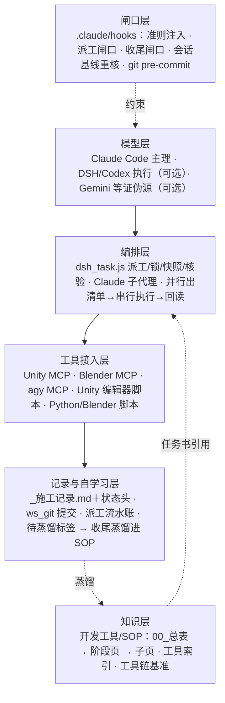

# vrc-avatar-agent-kit

用 Claude Code 当主理、子代理执行、钩子强制准则、SOP 自学习的 VRChat 头像定制工作流。

[English → README.en.md](README.en.md)

## 这是什么

一个真实在用的「捏人接单」工作区导出的公开版：客户给素材包，代理在 Unity/Blender 里完成捏脸、配色、服装与配饰装配、菜单与动画层、回归测试、性能优化、交付打包。仓库里是让这件事可重复的那部分：

- **分工**：Claude Code 做主理（流程把控、审美评估、兜底、维护规程、验收），执行活派给子代理（DSH / Codex，可选；没有就用 Claude 子代理）。
- **闸口**：Claude Code 钩子每轮注入 8 条强制准则，拦截主理直接改工程，回合结束前检查施工记录、证伪、提问方式。
- **规程（SOP）**：每个阶段一页确定化步骤表＋可自动查的通过判据，深水区在子页；改模、形态键、配饰、菜单、回归、优化、交付的判据都在里面。
- **自学习**：执行中撞墙当场打标签，阶段收尾由干净上下文的代理把标签蒸馏进 SOP 原处。
- **工具**：Unity 编辑器脚本、Blender/Python 脚本、派工与证伪脚本、MCP 服务器。

## 作者的话

你好，我是 Nymiro。

先说实话：这是一个实验性项目，到目前为止，它的投入产出比（ROI）依然偏低。遇到高水准的改模需求，我还在一边烧 Token 一边摸索它的边界，自己也得持续学习才跟得上。不过在已经摸清的边界之内，它确实能比较高效地产出模型，成本也在我个人认为合理的范围里。

比起一个开箱即用的「全自动改模工具」，我在这里分享的更多是一套结构化的思路。我自己也一直在用它提升产出的水平和效率，并会持续更新这个仓库。

也要提前说明：它的上手门槛比较高。刚开始用时，你可能需要大量人工介入去修正；但用下去会越来越顺手——执行中撞到的墙会在施工记录里标成「待蒸馏」，阶段收尾时再由不带对话历史的代理整理进 SOP，被推翻的结论也会留作反例。

如果你觉得它有用，又在使用中碰到了边界之外的问题，欢迎开 Issue 告诉我；如果你已经整理出了对应的内容，我非常希望、也非常欢迎你提交到本仓库。

另外，我在考虑做一个 TUI Harness。反馈足够多的话，会推着我加快进度。

欢迎加 QQ 群交流：**527190229**。

### 目前能做到哪里（保守估计）

前提：Unity 2022.3.22f1 加上冻结的插件版本；捏脸与形态键工具依赖 Blender。最低只需 Claude Code，DSH / Codex / agy 可选，但需要额外的账号或余额。下面每一档都要按你自己的素体和插件版本重新标定。

**比较稳**（有成文判据、工具和验收口径）

- 接单建档：挑包、开包按包内路径核兼容，预估参数与 PhysBone 余量
- 素材导入：解包、GUID 核对，工具链版本冻结与校验
- 捏脸落地：烘焙、闭眼补偿、导出与二进制自检，判据全是数字
- 服装装配按骨骼判兼容；配饰位姿由几何计算，偏心、夹角有阈值
- 菜单：参数 ≤256 bit、每页 ≤8 控件，有菜单生成器，不开 Unity 也能读菜单树
- 交付：冷导入编译、编译态菜单断言；工具通过只是必要条件，仍需第二视角复核

**能做，但要人盯或把审美关**

- 参考图解读：多个模型各自描述，描述不直接等于捏脸方案
- 捏脸定形：机器出候选，人来定（硬卡口）
- 配色：审美卡口，多模型评审，有分歧交给人
- 看图判断：视觉模型只能可靠地判断「有没有」，精确取色、计数、对齐做不到
- PhysBone 压到 256：有规程，但只实战过一次
- 面捕安装、部分插件 GUI、Unity 面板操作、SDK 上传需要人亲手做

**还做不好 / 仍在探索**

- 身体、脚部形态键适配服装：现有工程都没做好，相关流程只当样本
- 回归测试：旧版全 PASS 后被推翻，新版还没有验收过的通用流程
- 感知机制（声明对账）尚未并入每单必跑流程，部分阈值未标定
- 不让 AI 自由编辑顶点造型：实测直接动网格会捏出不成人形的结果，只允许调厂商形态键数值
- 从零建模饰品：仍在探索，尚未沉淀进 SOP

## 架构



每层的组件、文件位置和设计理由见 [docs/zh/架构与复刻.md](docs/zh/架构与复刻.md)。

## 最值得看的几条方法论

- **结论复述两遍以上，就交另一家模型证伪。** 复述次数与正确率无关，只会让自己更确信；自查的是「最近一次证伪的输入是不是我的结论」。→ [05 · 多模型评审规程](开发工具/SOP/05_多模型评审规程.md)
- **判据本身会坏。** 报「X 没生效」之前先问观测时刻、口径、校验脚本有没有 bug；零和相同都不等于通过。→ [判据本身可能是坏的](开发工具/SOP/问题定位/观测口径/判据本身可能是坏的.md)
- **冲突分类只问一句：用户之后还能不能自己把它打开。** 能 → 切换时用 Driver 改参数；不能、只在 A 开着期间压 → 单开一层写属性；同位置互斥 → 定优先级链，只压一侧。→ [03 · 装配与冲突通则](开发工具/SOP/03_装配与冲突通则.md)
- **配饰位姿靠算，不靠填。** 人形骨的局部轴由素体作者随手定，手填欧拉角必然八根手指八组数；孔轴、孔心、内径、滚转一律求解。→ [55 · 配饰装位](开发工具/SOP/55_配饰装位.md)
- **PhysBone 256 是构建期硬上限，不是评级差。** SDK 校验里写死的常量，超了不能上传；光靠同父合并到不了。→ [PhysBone 压到 256](开发工具/SOP/80_性能优化/PhysBone压到256.md)
- **给衣物补形态键，以 Unity `BakeMesh` 为准。** Blender 里往返核对 0 mm，导回 Unity 可以偏 71 mm；在 Unity 里给原网格副本加帧，基础几何与 bindpose 逐位不变。→ [给衣物补形态键](开发工具/SOP/50_服装发型装配/给衣物补形态键.md)
- **并行出清单，串行执行，紧跟回读。** 并行的边界是 Unity 单实例，不是依赖图；工具做成「清单 / 执行」成对入口。→ [01 · 自动化执行与并行](开发工具/SOP/01_自动化执行与并行.md)
- **现象当场记，规则收尾蒸馏。** 疲劳上下文随做随改 SOP 会造成跨页矛盾，事后补记又会被合理化，所以拆成两层。→ [收尾蒸馏与状态头](开发工具/SOP/04_施工记录与版本管理/收尾蒸馏与状态头.md)

## 快速开始

三档，按你手上有的东西选：

| 档 | 需要 | 得到 |
|---|---|---|
| 最小可用 | Claude Code | 钩子强制准则＋SOP 判据＋施工记录；执行活用 Claude 子代理 |
| 进阶 | ＋ agy（Gemini 等，走 `agy_panel.py` / `agy_mcp_server.js`） | 结论第三方证伪 |
| 全量 | ＋ DSH 和/或 Codex CLI | `dsh_task.js` 派工编排、按时段自动选引擎、会话日志核验 |

> ⚠ **钩子默认按「全量」档计数**：`delegate-check.js` 只在跑 `dsh_task.js` 后清零「直接改动」计数（第 3 次起拦截），`stop-gate.js` 只认 agy 调用算证伪。
> 只用 Claude Code 时，执行前用 `node .claude/hooks/delegate-check.js --exempt 用户确认 "<理由>"` 声明豁免（20 分钟有效），或按自己的编排改这两个钩子。详见[降级方案](docs/zh/架构与复刻.md#三降级方案)。

步骤：

```bash
git clone https://github.com/Bai-Mirror/vrc-avatar-agent-kit.git
cd vrc-avatar-agent-kit
cp kit.env.example kit.env                                # 填本机路径：工作区、Unity 安装根、素材库、存档目录等
cp .claude/settings.example.json .claude/settings.json    # 挂上钩子（5 个事件，4 个脚本）
cp .mcp.example.json .mcp.json                            # 按需保留 Unity / Blender / agy 的 MCP 条目
git config core.hooksPath 开发工具/通用工具/git-hooks      # 提交闸口：拦大文件与疑似密钥
```

然后按需改 [CLAUDE.md](CLAUDE.md)（模板；两行「强制准则」标记不要动），在 Claude Code 里打开仓库，从 `开发工具/SOP/00_总表.md` 开始。复刻清单与没有 DSH/Codex/agy 时的降级做法见 [docs/zh/架构与复刻.md](docs/zh/架构与复刻.md)。

## 目录

| 路径 | 内容 |
|---|---|
| [CLAUDE.md](CLAUDE.md) | 主理代理的工作区说明模板（含钩子注入的强制准则） |
| [.claude/hooks/](.claude/hooks/) | 4 个 Claude Code 钩子：`rules-inject.js` `delegate-check.js` `stop-gate.js` `session-start.js` |
| [开发工具/SOP/](开发工具/SOP/) | 规程正本（中文），从 `00_总表.md` 进 |
| [开发工具/通用工具/](开发工具/通用工具/) | 脚本与编辑器工具；`git-hooks/` 是提交闸口 |
| [开发工具/README.md](开发工具/README.md) | 工具与资产索引 |
| [开发工具/_工具链基准.md](开发工具/_工具链基准.md) | Unity、VRChat SDK 与各插件的冻结版本 |
| [docs/](docs/) | 架构与复刻说明（中英） |
| [en/](en/) | 英文译本（文件名为英文） |

## 按语言拉取

中文是正本；英文译本在 `en/` 下，文件名为英文，代码注释仍为中文。

只要中文：

```bash
git clone --sparse --filter=blob:none https://github.com/Bai-Mirror/vrc-avatar-agent-kit.git
cd vrc-avatar-agent-kit
git sparse-checkout set --no-cone '/*' '!/en/'
```

只要英文文档＋代码（去掉中文 SOP 与中文说明文档，保留脚本与钩子）：

```bash
git clone --sparse --filter=blob:none https://github.com/Bai-Mirror/vrc-avatar-agent-kit.git
cd vrc-avatar-agent-kit
git sparse-checkout set --no-cone '/*' '!/开发工具/SOP/' '!/开发工具/**/*.md' '!/docs/zh/'
```

根目录的 `README.md`、`CLAUDE.md` 会保留：钩子读 `CLAUDE.md`，缺了准则注入就不工作。

## 公开版说明

- 文中的「工程A」到「工程G」是匿名案例；路径缩写 `A/`…`G/` 指对应工程。
- 内部工单号、施工记录行号、私有文档引用只作出处标记，对应的原件不在本仓库。
- 本机路径已换成占位符（`<工作区>` `<素材库>` `<Unity安装根>` `<存档目录>` `<客户素材目录>`），由 `kit.env` 提供实际值。
- 不含任何客户素材、付费素材文件或厂商源码；SOP 里出现的商品名只用于说明兼容性与做法。

## 许可证

- 代码：[MIT](LICENSE)。
- 文档：[CC BY-NC 4.0](LICENSE-docs.md)。「文档」指 `开发工具/SOP/**`、所有 `*.md`、`docs/**`、`en/**`；其余文件按代码处理。

## 作者

Nymiro（nymiro@nymiro.moe）· GitHub [Bai-Mirror](https://github.com/Bai-Mirror)
