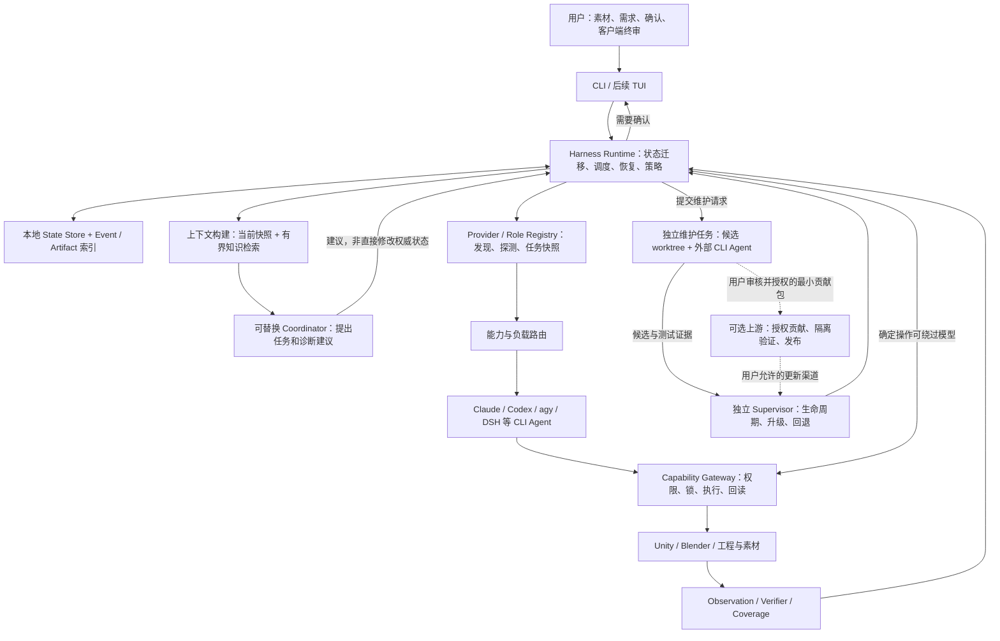

# Harness 架构提案：从 Agent 工作区到可恢复的 Avatar 生产运行时

> **状态：Draft / 架构方向基线，接口尚未冻结。**  
> **日期：2026-09-25。** 根据 Nymiro 与助手的项目讨论及作者逐项确认整理。  
> **用途：** 保留架构转向的原因、已确认决策、实施建议与待验证假设，让作者或新的执行 Agent 在另一台设备上直接接续。  
> **审阅基线：** `main` 提交 [`c50e969130c94d100cfd9ccead5d20569d0a999c`](https://github.com/Bai-Mirror/vrc-avatar-agent-kit/tree/c50e969130c94d100cfd9ccead5d20569d0a999c)。这是提交 SHA，不是本文的提交，也不是 Git tree 对象的 SHA。  
> **证据边界：** 当前架构判断来自公开仓库文档与关键实现的静态审阅；未在本次整理中运行 Unity/Blender、复现私有工程或完成端到端基准测试。本文描述的目标 Runtime、接口、目录和命令语义均为提案，不表示已经实现。

## 0. 接手摘要：先读这一节

下一阶段的重点是设计专门的程序化 Harness，而不是继续把所有控制逻辑堆进 SOP、Hooks 和旗舰模型的长上下文。

**核心方向：Harness 持有流程的权威状态、合法状态迁移、资源调度、验证结果与人工卡口；模型负责有界的理解、规划、执行和评审。** 旗舰模型不再被固定为主控制平面，但仍可直接承担高难度实际任务，并不只在廉价模型失败后才登场。

**MVP 的唯一业务终点：输入已有素材，检查完整度与兼容性，提出组装方案，经必要确认后完成简单改色/换衣等操作，经过构建、回归与交付验收，产出可上传、可使用的 Avatar。** 可以限制支持的素体、服装与目标平台，不可以把 MVP 缩成只完成 50→55→60 的几个阶段。

这里的“从零”指**从素材与干净工程起步**，不是从零生成三维网格；“全流程”允许少量明确的人机卡口，不等于取消人工上传和客户端终审。

### 0.1 作者已确认的八项决策

| 编号 | 已确认决策 | 对后续实现的约束 |
|---|---|---|
| D1 | 文档为“架构提案” | 放在 `docs/zh/Harness架构提案.md`，不是零散聊天摘录 |
| D2 | 思考记录与设计基线结合 | 保留为什么转向，同时给出可落地的对象、边界和验收；标注 Draft |
| D3 | 写下旗舰模型不再固定把控主线的方向 | Harness 持有状态，Coordinator 可采用成本较低的合适模型；具体模型效果待实测 |
| D4 | CLI-first, API-optional | 优先适配本机 Claude Code、Codex、agy、DSH 等可用 CLI；角色不按品牌写死 |
| D5 | 自升级是正式架构能力；Linux/systemd 为参考 | 外部 CLI Agent 生成候选，独立 Supervisor 控制停机、切换、重启与回退 |
| D6 | 内建主动贡献功能 | 上传前展示内容并获得明确授权；记录“分布式发现→本地修复→用户授权→上游蒸馏→全网更新”的构想 |
| D7 | MVP 必须产出完整可用模型 | 不要求创作型任务，但不能省去素材入口、计划、组装、验证与交付中的关键环节 |
| D8 | 实现语言只写建议 | 推荐 TypeScript/Node.js 核心配合现有 Python/C# 工具，不在本文冻结选型 |

**未被上述确认替代的事项：** 首个测试素体、具体版本组合、目标平台、准确 CLI 接口、上传服务器地址、数据库字段及贡献授权文本仍需在实施阶段核验。不要为了完成文档而凭空补上这些配置。

### 0.2 给下一位执行 Agent 的第一条要求

先读取本提案和现有工具，定义一套受限素材的**完整端到端验收合同**，再倒推最小 Runtime。内部可以分阶段开发，但任何局部演示都不能被标记为“MVP 已完成”。具体工作顺序见第 19 节，接续提示见文末。

---

## 1. 思路如何走到这里

### 1.1 起点不是“换一个更强的视觉模型”

项目希望让 Agent 在 Unity/Blender 中可靠完成 Avatar 改模。现有方法的重要方向，是把能测量的部分转为工程数据：骨骼、材质、参数、形态键、菜单、写者关系、几何距离和构建结果；视觉用于候选检查及无法充分形式化的观感判断。

这不是断言视觉模型永远不能精确观察，而是选择一个便于复验的工程基础：**不能只凭模型看图后说“像是对了”就交付。** 现有 [65 感知机制](../../开发工具/SOP/65_感知机制.md) 和 [70 回归测试](../../开发工具/SOP/70_回归测试.md) 已明确体现数据优先、缺测不得算通过的方向。

### 1.2 第一阶段：用 SOP 和 Hooks 约束主理 Agent

当前架构让 Claude Code 主理，其他 Agent 执行，配合规则注入、派工闸口、收尾检查、施工记录与收尾蒸馏。它已经不只是提示词集合；[架构与复刻](架构与复刻.md) 及 [dsh_task.js](../../开发工具/通用工具/dsh_task.js) 描述并实现了局部派工、锁、快照、日志核验与留痕等能力。

问题不在这些资产没有价值，而在于**跨阶段的流程协调仍大量依赖主理会话解释文档、记住状态、主动调用工具和解释结果**。

### 1.3 第二阶段：发现“中央流程仍在上下文里”

当前更接近：

```text
SOP 描述流程 → 主理模型解释流程 → 派工脚本执行 → 回读与日志 → 主理决定下一步
```

目标是：

```text
Runtime 持有流程 → 按状态调用模型或工具 → 独立验证 → Runtime 决定是否允许迁移
```

这里的“中心空洞”是对**缺少统一跨阶段控制内核**的架构判断，不是说仓库完全没有状态、编排或恢复能力。

### 1.4 第三阶段：不必让旗舰模型一直当项目经理

作者提出：用固定的上下文状态结构、程序化 Harness 和足够智能的次级模型管理任务，把实际难题通过负载均衡交给 Claude、GPT 等顶级模型。

采纳这一方向，但做两项收束：

- **RAG 检索知识，不保存当前任务事实。** 当前状态必须能直接、确定地查询。
- **便宜 Coordinator 能否胜任是待验证假设。** “上下文够长”不是充分条件，结构化输出、任务书质量、异常升级判断和总体成本都需要测试。

对话中出现的 Opus、Sol、DeepSeek V4.1 Flash 等名称用于说明候选资源，不成为永久角色绑定；具体可用模型、模型标识与能力按每次任务初始化得到的 Provider 快照处理。

### 1.5 第四阶段：CLI Provider 同时提供外部维护能力

作者希望复用已有 CLI 和订阅，而非默认以 API 承担全部成本；同时，外部 CLI Agent 可以把 Harness 当作普通仓库修改，避免必须由正在被修改的 Runtime 完成自己的停机与重启。

这引出两个独立闭环：**Avatar 生产闭环**和**Harness 维护闭环**。后者需要稳定的 Supervisor，不是给普通执行 Agent 无限制的自我修改权限。

### 1.6 最终修正：MVP 必须是一条完整纵向生产链

讨论曾建议先以 50→55→60 验证 Runtime。作者明确修正：它可以是内部里程碑，不能是产品 MVP 的最终范围。第一版宁可只支持简单改色、适配好的换衣，也必须从素材走到可用成品。

---

## 2. 当前资产与架构差距

以下区分“已有证据”和“建议补齐”，不采用没有实测依据的完成百分比。

| 领域 | 仓库已经具备 | 目标差距与迁移方向 |
|---|---|---|
| 工作流 | 00–95 阶段、输入输出、卡口和依赖 | 将稳定依赖与完成条件变为持久化、可检查的运行时规则 |
| 派工 | `dsh_task.js` 的 DSH/Codex 路由、锁、快照、留痕检查 | 统一 Task/Run 生命周期、Provider 协议及跨任务调度，不从零重写成熟脚本 |
| 规则闸口 | 四个 Claude Hooks | 与具体会话工具名耦合的提醒，逐步迁为执行边界上的检查；保留旧模式兼容 |
| 工程观测 | T1/T3/T4、静态写者图、几何量距等 | 给观察补统一来源、时间、工程版本和 Edit/Build/Play/Client 口径 |
| 验证 | `perception`、阶段数字判据、冷导入和菜单断言 | 统一 Verdict 与覆盖率语义，并把必要检查接入交付硬门槛 |
| 恢复 | git、快照、基线重核、施工记录 | 加入运行中断后的对账、幂等重试、场景恢复及副作用不确定状态 |
| 人机反馈 | SOP 人工卡口及聊天提问 | 持久化 Gate，绑定待批准的具体版本，不依赖上一轮对话 |
| 学习 | 现象当场记录，独立上下文收尾蒸馏 | 候选规则附证据、反例与适用版本；验证后才提升为稳定规则 |
| 自维护与贡献 | 当前讨论形成的方向 | Supervisor、候选升级协议及用户授权的最小贡献包 |

证据入口：[总表](../../开发工具/SOP/00_总表.md)、[自动化执行与并行](../../开发工具/SOP/01_自动化执行与并行.md)、[Hooks](../../.claude/hooks/)、[收尾蒸馏与状态头](../../开发工具/SOP/04_施工记录与版本管理/收尾蒸馏与状态头.md)、[交付打包](../../开发工具/SOP/90_交付打包.md)。

### 2.1 两个不能被架构乐观判断掩盖的缺口

**感知对账尚未成为每单必跑主干。** [65](../../开发工具/SOP/65_感知机制.md) 明确写到 `verdict.py` 的集成状态及部分阈值未标定。因此“有判定器代码”不等于“全流程已由判定器把关”。

**构建产物到可信 Play 回归的链路仍有阻断。** [70](../../开发工具/SOP/70_回归测试.md) 写明：尚无已验收的“批处理产物→免重构建 Play”通用流程。对最终 Avatar 行为作保证前，必须为 MVP 支持的版本组合实际解决这一链路；不能只把调度器接上线就宣布回归完成。

[扇出与工作流判据](../../开发工具/SOP/01_自动化执行与并行/扇出与工作流判据.md) 的“全自动”标签应与 README 的保守边界一起理解：**动作可自动执行、结果可充分验证、跨素材可泛化、可无人值守，是四个不同维度。** 后续评估分开记录，不用“脚本执行结束”替代正确性。

---

## 3. 架构差距图与目标结构

### 3.1 从现状到目标

```text
现状资产                         目标运行时对象
────────────────────────────────────────────────────────
SOP 阶段、步骤和依赖      →      Workflow / Stage / Policy
主理模型临时写任务书      →      Context Builder + Coordinator
DSH/Codex 派工脚本        →      Provider Adapter + Run
各脚本入口与执行约定      →      Typed Capability
分散的回读与判据          →      Observation + Verdict
施工记录、流水账、状态头  →      State Store + Event + 人类可读视图
git / 局部快照            →      Mutation Journal + Recovery
聊天中的确认             →      持久化 Human Gate
随会话更新的模型分工      →      每任务冻结的 Provider / Role 快照
本地 Agent 修改程序       →      Candidate Upgrade + Supervisor
待蒸馏经验               →      已验证规则 / 自愿上游贡献
```

这些箭头是**包裹、迁移和明确边界**，不是要求删掉右移前的全部工具。

### 3.2 目标组件图



TUI 是控制台而非控制内核。没有 TUI，生产任务应仍可运行、暂停、恢复与导出状态。

---

## 4. 控制权与模型分工

### 4.1 三类职责

| 层次 | 负责 | 不负责 |
|---|---|---|
| 确定性 Runtime | 当前状态、依赖、锁、权限、重试上限、事件、判据聚合、批准有效性 | 凭自然语言猜测工程事实 |
| Coordinator | 解释当前任务、补全任务书、选择候选能力、判断何时请求诊断或人机反馈 | 自行把任务置为通过、直接改数据库、绕过验证 |
| 执行/专家/评审 Agent | 写代码、复杂素材分析、排障、评审、提出新工具候选 | 因“我已经检查过”而免除独立回读和验收 |

**不要把 Coordinator 设计成另一个超级长提示词。** 当动作已经确定时，Runtime 可直接调用工具；只有需要判断时才调用模型。

**也不要把所有实际任务强行降给便宜模型。** 作者希望通过 CLI 负载均衡使用顶级模型。这意味着困难任务可一开始就路由到高能力 Provider；简单确定任务走脚本；Coordinator 的成本等级与执行器成本等级分别配置。

### 4.2 升级判断

升级条件建议采用外部可观察信号：重复失败、结果不一致、缺少可用 Capability、验证不可判定、输入超出支持范围、风险等级较高。模型自报 confidence 只能是辅助信息，不应成为唯一门槛。

升级失败或无可用 Provider 时进入 `BLOCKED` 或 Human Gate，不得无限重试，也不得为了把流水线跑完而放宽交付标准。

### 4.3 验证这次架构转向

在相同素材、任务合同、工具和验收下，对比“旗舰 Coordinator”与“次级 Coordinator”。至少记录任务完成率、无效重试、任务书缺项、错误升级/漏升级、人工介入时间、总耗时及可观测用量。

优化目标是**每个通过验收的成品所需总成本与时间**，不是某次模型调用的最低单价。本文不预设廉价模型能覆盖多少百分比。

---

## 5. Provider 与角色：每次任务初始化时读取

### 5.1 概念必须分开

- **Provider：** 一个可调用的本机 CLI / 可选 API 后端及其账户上下文。
- **Model：** Provider 实际使用的模型；可能只能得到请求别名，不能得到服务端真实版本。
- **Role：** 本次任务的 Coordinator、Executor、Diagnostician、Reviewer 等职责。
- **Capability：** 完成某种任务所需的可检验能力，不等同于模型品牌。

同一个 Provider 可以承担多个角色；不同任务可以给同一角色换 Provider。不要把 `codex` 当作具体模型名，也不要因某个 CLI 已安装就认为对应账号、模型、图像输入与权限一定可用。

### 5.2 任务初始化协议

```text
读本地用户配置及角色策略
→ 从已注册 Adapter 获取工具/Provider 清单
→ 检查路径、版本、登录状态和健康信息
→ 对需要的关键能力做缓存或最小探测
→ 区分 declared / probed / unknown
→ 得到本次候选 Provider 与角色描述
→ 应用用户权限、预算及能力约束
→ 冻结本次任务的 registry_snapshot / policy_version
→ 派发
```

“每次读取”不要求每次都发付费测试请求。低成本本地查询可以逐次执行；较贵探测使用有效期，CLI 更新、授权变化或失败时使缓存失效。

正在运行的任务使用初始化时冻结的快照。配置改变影响后续 Run；不得让角色、模型或权限在一次任务中无记录地漂移。

### 5.3 Provider 描述草案

```yaml
schema_version: provider/0.1
provider_id: local-codex
transport: cli
adapter_id: codex-cli
executable: codex
roles_allowed: [executor, diagnostician, reviewer]
capabilities:
  repository_edit:
    status: probed
    evidence_ref: probe-001
  image_input:
    status: unknown
health: ready
auth_mode: cli_managed
billing_mode: unknown
quota:
  remaining: null
  observed_at: null
limits:
  max_concurrent_runs: 1
policy:
  allow_project_write: true
  allow_harness_live_write: false
  allow_contribution_upload: false
```

这只是字段语义示例，不是可直接部署的配置或对 Codex 固定能力的保证。`null/unknown` 不等于额度为零，也不等于无限额度。

角色初始化还应包括：目标、禁止事项、可调用工具、输入材料、输出 schema、完成标准和升级条件。不要依赖 Provider 上一段对话“还记得自己是什么角色”。

### 5.4 CLI-first 的收益与边界

CLI-first 是作者基于现有订阅和工具环境选择的优先路线，不是“CLI 天然免费”这一假设。DSH 等 CLI 也可能调用按量计费的 API；同一个 CLI 的不同认证方式可能使用不同预算池。

官方文档提供了可用的自动化接入方向：Codex 有 `codex exec`、JSONL 事件和结构化结果；Claude Code 有 `-p` 与 JSON/stream-json 输出。应优先使用这些公开接口，并按实际安装版本核验，而非解析交互式 TUI 文本。[E1][E2]

**认证、成本与许可单独判断。** Codex 文档区分 ChatGPT 订阅访问与 API key 计费；不能从命令名推断本次调用走哪个账单。[E3] Claude 的官方说明对普通官方应用使用、开发产品的认证和第三方代用户路由有明确区别，并禁止第三方收集或中转 Claude.ai 凭据。[E4]

因此本方案要求：登录由原 CLI 官方流程处理；Harness 不导出或转用订阅 OAuth token，不托管用户账号形成共享额度池。**CLI-first 不自动构成每家服务对每种封装方式的许可**；本地个人使用与对外分发产品应分别核验接入路径。无法确认或不受支持的 Adapter 应禁用该模式，提供符合要求的可选后端，而不是绕过限制。

`agy`、`DSH` 按本仓库实际使用的可配置工具处理，不假定它们都具备与官方 CLI 相同的稳定协议或支持承诺。

---

## 6. 负载均衡与 CLI 子任务生命周期

### 6.1 先过滤，再选路由

先按能力、输入类型、权限、版本适配、数据外发策略和账户使用条件排除不合格 Provider，再根据并发槽位、队列等待、冷却时间、额度信息、历史任务表现和成本偏好选路由。

第一版用简单可解释的策略，不需要学习型路由器。记录选择理由，方便回答“为什么这次派给 Codex，而不是 Claude”。

### 6.2 统一 Adapter 协议

建议边界：

```text
discover / probe / start / observe / cancel / collect
resume（可选，不支持必须声明）
```

统一输出至少包括 `task_id`、`run_id`、Provider、请求模型、实际报告模型、会话标识、开始结束时间、退出状态、结构化结果、Artifact 引用、用量来源和错误类别。

**CLI 退出码成功 ≠ 任务完成。** Runtime 还必须检查预期文件、独立回读和 Verifier。Provider 的内部计划与会话日志可作为证据，不能覆盖权威任务状态。

### 6.3 错误分类决定下一步

| 类别 | 默认处理建议 |
|---|---|
| 未登录/权限不足 | 进入授权 Gate，不让模型反复尝试登录 |
| 限流/额度耗尽 | 按冷却时间等待或改派合格 Provider；不绕过账户限制 |
| 超时/中断 | 标记执行结果待对账；确认副作用后才能重试 |
| CLI 协议/输出解析变化 | 隔离该 Adapter，诊断或维护，不能只靠 grep 猜成功 |
| 工具执行失败 | 保留证据、分类诊断、有限重试 |
| 业务 Verifier 失败 | 修改方案或升级专家；不能换一个 Provider 就忽略失败 |
| 安全或权限拒绝 | 按真实原因处理，不把绕过拒绝当作负载均衡目标 |

取消任务要处理整个受管理进程组及后代，并等待终止确认。只结束父 CLI 而留下仍在操作 Unity 的子进程，不算取消成功。

### 6.4 并行的边界

复用现有 [01 编排原则](../../开发工具/SOP/01_自动化执行与并行.md)：并行分析和清单生成，串行修改同一工程/编辑器，然后立即回读。

模型并发槽与工程写锁是两种不同资源。两个 Provider 都空闲，不代表它们能同时修改同一个 Unity 工程；代码准备可在隔离 worktree 并行，应用到活动工程仍经统一入口。

---

## 7. 持久状态与最小数据模型

### 7.1 第一版建议的对象

| 对象 | 最小职责 |
|---|---|
| Workflow | 输入集合、用户需求、目标平台、计划版本、整体交付状态 |
| Stage | 业务阶段、依赖、适用性、必要验收 |
| Task | 目标、输入、能力需求、预期输出和重试策略 |
| Run | 一次实际执行尝试；Provider、进程/会话、快照、结果 |
| Capability | 输入输出协议、权限、资源、动作及验证入口 |
| Artifact | 文件/目录/报告的位置、哈希、来源、生命周期与敏感级别 |
| Observation | 针对某工程快照、某运行口径的测量 |
| Verdict | 某验收项的结果、证据、版本与覆盖范围 |
| Gate | 等待用户做的具体决定及该决定所对应的版本 |
| Event | 谁在何时对哪个对象做了什么、为什么 |
| ProviderSnapshot | 此次任务采用的工具、模型、角色及策略快照 |
| Mutation/UpgradeRecord | 副作用或版本切换的准备、执行与恢复记录 |

第一版不必为每个逻辑对象建单独服务或复杂继承树。建议单机 SQLite 保存工作流状态、运行记录和事件索引，文件系统保存大 Artifact；这只是实现建议，不是已冻结 schema。

### 7.2 状态不能混用

Task 建议状态：

```text
PENDING → READY → RUNNING → VERIFYING → PASSED
                   │           │
                   ├── WAITING_HUMAN
                   ├── BLOCKED / FAILED / CANCELLED
                   └── RECOVERY_REQUIRED
```

这不是完整状态转换表，实施时需列出每条合法边及守卫条件。重试创建新的 Run，保留旧 Run，不能把失败证据覆盖掉。

`WAITING_HUMAN` 是任务等待原因；`no_data` 是某项检查缺少数据；`advisory` 是严重程度或建议属性。三者不应塞进同一个含义混乱的枚举。

### 7.3 权威状态不意味着数据库替代现实

数据库是**工作流事实**的权威来源；Unity/Blender 与文件系统是**工程当前状态**的观测来源。人手修改工程、外部进程写入、崩溃或脚本域重载，都可能使数据库中的旧快照失效。

启动、恢复和关键 mutation 前，必须 reconcile：读取实际版本、运行进程、工程指纹和未提交改动；发现差异后使受影响的计划或验收失效，而不是强迫现实符合日志。

### 7.4 事件与状态一致性

状态更新与对应事件应在同一数据库事务内提交。发出 CLI 任务前先持久化调度意图，通过 dispatch 记录或 outbox 等机制识别“记录了但没启动”和“启动了但没收到回执”。

不需要第一版就实现完整事件溯源平台；需要的是可解释历史、可恢复的当前快照，以及模型不能直接改写已发生事实。

---

## 8. RAG、上下文与知识演进

### 8.1 两种记忆严格分开

```text
当前状态：Task/Run/Gate/Artifact/Event 的确定查询
历史知识：SOP、排障案例、反例、工具说明、阈值依据的检索
```

一次 Coordinator 输入建议由以下材料构成：当前 Workflow 摘要、当前 Task、相关 Artifact/Observation、必要的近期 Event、合法动作列表及少量对应 SOP。

不要默认灌入整个仓库或整段历史对话；也不要假定模型必须活过整个订单。让新会话凭同一份材料接续，应成为验收项。

### 8.2 先做可追溯检索，不先造向量平台

按阶段、工具、素材类型、症状及版本过滤，结合确定路径和全文检索；当确实需要语义召回时再增加向量检索。

每条检索结果保留来源路径、提交/内容哈希、有效范围、规则成熟度与反例。旧结论、已撤回阈值和不同插件版本下的经验，不能因语义相近而被直接用于当前门槛。

### 8.3 SOP 不是全部“编译成 if/else”

稳定的依赖、权限、输入输出和验收条件程序化；诊断策略、案例解释与未知情况仍允许模型推理。固定状态机负责控制框架，不必预先枚举每一种故障。

出现新问题时允许提出新的诊断 Task、方案修订或 Capability 候选，但要经过版本化和验证后使用。否则“程序化”会退化为脆弱的素材特判库，也背离通用适配的原始方向。

### 8.4 保留两层蒸馏

复用 [收尾蒸馏与状态头](../../开发工具/SOP/04_施工记录与版本管理/收尾蒸馏与状态头.md)：执行时记事实，收尾时用独立上下文形成候选规则。

建议增加规则生命周期：`candidate → tested → accepted → deprecated`。候选附触发条件、正反例、来源和适用版本；自动总结不得直接替换生产门槛。

---

## 9. Capability 与受控工程事务

### 9.1 先包现有工具，不重写所有脚本

第一版建议包装的业务能力包括：

```text
assets.inventory / assets.validate
project.initialize / assets.import
material.recolor / clothing.install
accessory.place / menu.configure
avatar.observe / avatar.build / avatar.verify
performance.check / delivery.package / delivery.cold_import
```

这些是建议的逻辑名称，不表示仓库已有同名接口。每个 Adapter 应映射到已存在且经验证的脚本；不足的能力明确标为待实现。

Capability 声明输入输出、可读写目录、修改范围、所需资源、前置条件、成功证据、幂等性及恢复方式。稳定动作由 Runtime 调用；需要临时写代码的 Agent 先在候选目录生成代码，经检查再按统一执行入口应用。

### 9.2 执行链

```text
PLAN → PRECHECK → SNAPSHOT → APPLY → READBACK → VERIFY
                                         ├─ 通过：记录 COMMIT
                                         └─ 失败：恢复/补偿/诊断/等待人
```

这里的“事务”是受控副作用协议，**不是声称 Unity、Blender、CLI 和数据库能组成一个原子数据库事务**。

### 9.3 三个重要限制

**git 不等于完整工程快照。** 大资产、未跟踪文件、未保存场景、导入缓存或外部素材可能不在版本控制中。恢复方案必须说明覆盖了哪些内容。必要时在隔离工程副本中构建；不得自动丢弃用户未保存修改。

**普通 worktree 不等于安全沙箱。** 它隔离工作文件，不会自动限制进程访问其他目录。必须结合 CLI 权限、操作系统权限或容器等边界；维护 Agent 的实际权限不能只写在提示词里。

**并非每个动作都有可靠回滚。** 对能恢复的写入保存快照；对可补偿的动作写明补偿；对无法自动恢复的行为设置 Gate。恢复不确定时停止，不得为了继续而破坏更多状态。

### 9.4 锁、租约与防旧任务写入

锁建议至少按 `project:<id>`、`unity:<instance>`、`blender:<instance>` 区分，并记录持有 Run。所有实际写入口必须遵守同一锁协议。

租约超时不能独自证明旧进程已停止。恢复时先确认进程生命周期；具备网关能力时用递增的 fencing token 拒绝旧执行者继续写。若现有工具不能校验 token，就明确采用更保守的单写者/终止确认方案，不宣称已具备强隔离。

### 9.5 崩溃后的关键语义

若动作已执行但回执丢失，进入 `RECOVERY_REQUIRED`：先查命名稳定的输出、修改日志与工程指纹，再决定接受已有结果、恢复或重试。

目标是“重复派发可识别，副作用可对账”，不是在缺乏工具支持时承诺 exactly-once。Task ID、Run ID、幂等键和 Artifact 哈希不能省略。

---

## 10. World Model、Observation 与 Verifier

### 10.1 不建立一个没有时间和口径的“大 JSON”

统一状态首先应统一引用与证据协议，而不是把所有工具输出粗暴合并。至少区分：

- 源资产/编辑场景；
- 经插件预处理后的构建产物；
- Play 回归中的运行状态；
- VRChat 客户端中的最终行为。

每份 Observation 建议含工程/构建快照标识、目标对象标识、观测口径、时间、工具版本、单位和原始证据引用。对象改名、网格合并或构建生成时，保留源对象到构建对象的映射；不同口径不能仅靠名字相同就覆盖。

### 10.2 “系统知道什么是对”的来源

期望来自用户批准的组装方案和独立定义的业务合同；Observation 来自工具实际读值；Verifier 对账。

```text
已批准方案 → expectation
真实工程   → observation
二者对账   → verdict + coverage
```

不能让生成器同时凭自己的实现生成全部期望，然后用这些期望证明自己正确。多模型评审增加检查视角，但不能替代直接测量，也不能保证不同模型的错误相互独立。

### 10.3 Verdict 草案

```json
{
  "schema_version": "verdict/0.1",
  "check_id": "menu.toggle_roundtrip",
  "task_id": "task-006",
  "run_id": "run-002",
  "artifact_ref": "build-004",
  "observation_scope": "built_play",
  "result": "pass",
  "severity": "blocking",
  "required": true,
  "expected": "off → on → off returns to the declared baseline",
  "observed_ref": "artifact:t1-sequence-004",
  "coverage_ref": "coverage:required-menu-controls",
  "tool_version": "source-hash",
  "policy_version": "profile-hash"
}
```

结果建议含 `pass / violation / no_data / undecidable / error / not_applicable`；严重程度另设 `blocking / warning / advisory`。未执行检查记录未执行原因，不伪装成不适用。

`not_applicable` 也需要理由与规则依据。例如方案没有面捕，面捕安装阶段可不适用；“工具跑不起来”不能成为不适用的理由。

### 10.4 交付聚合原则

只有必要检查全部有有效证据且通过，才允许进入自动化的交付就绪状态。`no_data`、`undecidable`、执行错误和必要检查缺席均阻断。

低严重程度警告可以由事先定义的策略或用户明确接受，但接受警告不应把原始 Verdict 改成通过。变更影响构建产物时，相应验收自动失效。

### 10.5 先完成受限闭环，不等待通用感知研究全部结束

MVP 接入本次支持素材所必需的 65/70 能力。未知阈值不得作为硬通过证据；优先选择可验证的素材和变更范围。

无需先解决任意衣服跨素体适配，但不能因为通用感知难，就跳过所承诺换衣功能的行为与客户端验收。

---

## 11. MVP：完整但受限的 Avatar 生产闭环

### 11.1 输入合同

建议首个验收样例采用一套已知结构的素体、一套明确适配该素体的服装，以及简单材质改色需求；已有发型/配饰可作为可选项。以一个明确目标平台建立最小支持矩阵，优先单平台是建议，不是作者已经冻结的选择。

工具链版本按实际验证结果冻结。现有版本基准见 [工具链基准](../../开发工具/_工具链基准.md)，它是起点，不等于任何新设备都已满足条件。

不要求原创建模、自由雕刻、原创贴图或任意服装的通用变形求解；保留素体原有脸型与已配置功能。无关阶段以有依据的“不适用”处理，不能把全流程误解为每次必跑所有历史 SOP。

### 11.2 业务阶段与通过依据

| 阶段 | 必须完成 | 必须保留的证据/产物 |
|---|---|---|
| 初始化 | 检查工具、版本、磁盘、运行环境和 Provider；创建干净工作工程 | 环境报告、版本锁、Workflow ID |
| 素材检查 | 识别素体、服装、依赖、材质、贴图及引用；判断完整度和兼容性 | 素材清单、缺失项、支持/不支持/待核结论 |
| 组装方案 | 指定使用哪些素材、层级/骨骼关系、配色、菜单、保留功能及风险 | 结构化计划、预期结果、人类可读说明 |
| 人机确认 | 用户确认计划或处理缺件/歧义 | 绑定计划版本的 Gate 决定 |
| 导入与配置 | 顺序导入所需资产、建立正确 Avatar 根与基础设置 | 导入报告、GUID/引用核对、工程快照 |
| 简单改模 | 应用批准的换衣/改色；必要时装已有发型或配饰 | 修改清单、回读、实际使用素材对账 |
| 菜单与功能 | 保留或配置所需菜单/动画；默认状态正确，切换可回退 | 参数/菜单期望、构建后映射与行为测试 |
| 构建和回归 | 跑实际目标构建、必要 65/70 检查和动态/序列测试 | 构建产物、Verdict、覆盖记录、定点预览 |
| 性能与硬限制 | 读取实际构建/SDK 检查；必要优化后重验 | 硬阻断项报告、性能报告、优化后回归 |
| 打包与冷验证 | 输出可重开交付工程，在干净目录验证依赖、编译和关键行为 | 交付包、Manifest、哈希、说明、自测清单 |
| 上传与客户端终审 | 用户完成登录/上传等账户操作，验证成品可用 | 上传/本地测试状态、客户端自测与缺陷记录 |

这是对现有 [总表](../../开发工具/SOP/00_总表.md)、[70](../../开发工具/SOP/70_回归测试.md)、[90](../../开发工具/SOP/90_交付打包.md) 的受限落地，不是并行创建另一套互相矛盾的业务规范。

### 11.3 素材完整度不是文件数量相等

至少检查：哪些组件是必需的、依赖是否可取得、引用是否解析、服装对应哪个素体版本、纹理/材质是否成套、同 GUID 是否冲突，以及用户是否确认有权使用所选素材。

输出状态建议为 `ready / missing_dependencies / incompatible / needs_confirmation`，并逐项解释。可以展示进度比例，但不能用“完整度 95%”掩盖一个会阻止构建的必需文件缺失。

不自动购买素材、不绕过授权、不把未使用的原始包当作已接入。延续仓库的“导入不等于用上”：每项选中素材必须能追踪到实际产物或明确记录弃用原因。

### 11.4 人机反馈应少而明确

至少保留方案确认、无法消解的素材歧义、必要的外观预览与最终上传/自测。正常机械操作不应每一步都问人。

缺少关键依赖时暂停受影响链路；可以继续其他只读准备。用户不回应，不得由模型虚构回答。

### 11.5 “可上传”与“已验证可使用”分别记录

建议定义两个不同里程碑：

- `UPLOAD_READY`：最终交付工程完成冷导入、真实目标构建、必要 SDK 校验及要求范围的行为验证，无未解决的交付阻断项。
- `CLIENT_VERIFIED`：在用户授权并完成账户步骤后，对对应成品实际上传/在客户端使用，并完成自测。

**MVP 发布验收至少要有一个真实样例到达客户端验证，并证明上传路径可行。** 自动化边界可以止于 `UPLOAD_READY` 后等待人工，但产品不能以一张绿色测试报告冒充完整成品演示。只有本地测试、没有实际上传时，必须分别标记，不声称已验证上传成功。

VRChat 官方区分 Build & Test 与 Build & Publish；账号权限和上传资格也与工程正确性不同。流程可以等待用户处理账户条件，但不能把账户阻断误诊为必须修改模型。[E5]

### 11.6 交付清单

建议最少输出：成品工程/交付包、版本与依赖清单、所选 Avatar 根和计划版本、实际应用素材表、构建与回归报告、必要警告/未测范围、预览、上传及客户端自测说明。包中只包含合法允许交付的内容，不把付费素材、客户数据或本地凭据推入公开 Git 仓库。

最终验收针对**真正打包后重新打开的工程**。优化、清理开发依赖或打包排除规则都可能影响交付，不能只验证打包前的源场景。

---

## 12. 工作流依赖与失效传播

00–95 SOP 继续作为知识入口，Runtime 管理实际任务依赖。当前 [01](../../开发工具/SOP/01_自动化执行与并行.md) 已记录更换 FBX 可能使材料配置、骨架锁和服装装配返工；目标系统应能表达这类影响，而不仅是固定编号顺序。

```text
输入/版本/用户计划改变
→ 找到依赖的 Artifact 和 Verdict
→ 标记 stale
→ 创建必要重做/重验任务
→ 重新批准受影响的方案
```

性能优化后也需要对最终产物重验。不要把流程写成“70 通过→80 改了很多东西→直接交付”，却继续沿用优化前的全部证据。

MVP 可先用显式依赖清单，后续再细化到 Artifact 级别的变更影响分析；不必第一版实现复杂通用 DAG 引擎，但不得遗漏关键失效边。

---

## 13. Human Gate 与跨会话接续

Gate 至少记录问题、原因、选项、默认行为、受阻任务、对应计划/Artifact 哈希、授权范围、创建时间及批准者。

**批准的是具体版本，不是泛化口头承诺。** 用户批准方案 A 后若模型改成方案 B，旧批准不得继续有效；自升级候选和贡献包同理。

换设备的第一版路径可以是远程连接同一台 Runtime 主机读取状态。持久 Gate 不自动意味着已经实现多机数据库同步；不要让两台机器同时写同一个复制出来的 SQLite 文件来冒充同步。

TUI 后续展示阶段、当前任务、锁、证据、待决项和交付包；第一版 CLI/文件报告应先满足“看得懂为什么停住、如何继续”。

---

## 14. Harness 自升级与稳定 Supervisor

### 14.1 采纳作者构想，但拆开“修程序”和“替换运行版本”

外部 CLI Agent 可以修 Harness 仓库、补测试、生成候选；独立 Supervisor 执行受限的停机/切换/重启。升级并非完全不需要引导机制：**Supervisor、更新策略和恢复状态是必须保留的稳定底座。**

首个参考环境为 Linux/systemd。不要把 systemd 当成开箱即用的版本管理器：它负责进程生命周期，项目仍需实现候选选择、迁移策略、健康检查与失败回退。

### 14.2 目录与权限建议

```text
~/.avatar-harness/
  releases/<version>/          # 发布后不原地修改
  current                     # 指向活动版本的引用
  state/                      # 独立于代码版本的持久状态
  backups/<upgrade-id>/        # 状态与必要资产的升级前备份
  worktrees/<upgrade-id>/      # 维护 Agent 的候选工作区
  upgrades/<upgrade-id>/       # 清单、测试证据、切换日志
```

目录布局是建议。维护 Agent 仅有候选工作区及必要只读材料的访问权限，不获得 live tree、生产数据库、发布签名密钥或任意服务管理权限。

### 14.3 独立生命周期是必要条件

**执行升级的 CLI Agent/维护作业必须由独立服务或独立作业管理，不能依赖即将被停止的 Runtime 存活。** 部署时要核验 Supervisor 停止 Runtime 时对其后代进程的处理；“只是 spawn 出一个子进程”不代表该进程一定能在父服务关闭后继续。

也不应为了维护 Agent 存活就放任普通生产子任务变成孤儿进程。生产执行与维护执行分别管理，停机前把工程写入排空。

### 14.4 升级协议

```text
发现缺陷 / 用户提出升级
→ Runtime 持久化维护请求
→ 独立维护作业在 worktree 派发 CLI Agent
→ 生成候选代码、测试和变更解释
→ 独立验证并得到所需用户批准
→ 进入维护模式，停止接收新写任务
→ 等待或受控取消现有 Run，确认资源释放
→ 保存一致状态与备份
→ Supervisor 停止旧 Runtime
→ 切换候选版本，运行兼容性/迁移检查
→ 启动新 Runtime，先只读健康检查及恢复对账
→ 通过后允许继续原 Workflow
→ 失败则按已验证恢复方案退回
```

候选代码可以在旧 Runtime 继续工作时准备；真正切换必须等待安全点。

### 14.5 Upgrade Manifest 的最低内容

记录 `upgrade_id`、基线版本/提交、候选提交与包哈希、兼容状态 schema 范围、测试证据、是否迁移、备份位置、激活批准引用及回退计划。

Agent 写下 `tests: pass` 不构成放行。Supervisor/独立校验器必须验证证据、候选身份和批准是否匹配，且不能执行 Manifest 中任意未经约束的 shell 指令。

### 14.6 回退不只是切回代码

数据库迁移可能让旧 Runtime 无法读取新状态。MVP 首次升级演示建议**不改变数据库 schema**，先验证外部修复、停机、切换、健康检查和原任务恢复。

未来允许迁移前，必须测试旧状态兼容性、备份恢复与新版本失败场景。备份只能在写入排空后的安全点制作；不能恢复一份旧数据库而默默丢掉已经接受的新任务。

Supervisor 自身升级另设人工维护路径，不交给同一轮自升级事务循环修改。

### 14.7 自升级验收

成功样例：新版本启动并从旧 Workflow 接续。失败样例：候选启动失败，退回旧版本并保留任务、证据和批准记录；维护 Agent 生命周期独立，普通生产任务没有遗留写进程。

只有版本号变了或进程重新启动，不算自升级验收通过。

---

## 15. 用户授权贡献与上游改进网络

### 15.1 产品功能，而非强制回传义务

采用作者确认的第一种方案：本地 Agent 修复 Harness 后，提示用户是否贡献。拒绝、跳过或永久关闭提示，不应影响本地继续使用。

本提案不修改现有许可证。仓库代码与文档的适用范围以 [LICENSE](../../LICENSE) 和 [LICENSE-docs.md](../../LICENSE-docs.md) 为准；后者当前规定文档采用 CC BY-NC 4.0、其余代码采用 MIT。后续代码贡献与文档贡献应分别采用相应授权文本；本次讨论不等于作者已经选择 CLA、双许可或重新许可。

### 15.2 最小 Contribution Bundle

建议字段：基线提交、工具/系统的非敏感版本信息、经过用户检查的问题描述、失败特征、最小 patch、新增测试、修复前后证据、贡献许可声明、Bundle 哈希。

默认不包含完整 Agent 对话、整个工作区、客户工程、素材包、截图、认证文件或私有 SOP。确需额外材料时分别显示并授权。

### 15.3 上传流程

```text
检测到候选通用修复
→ 从限定 worktree 生成最小 diff
→ 剔除禁止上传的文件类别
→ 扫描密钥、路径、身份信息及素材信息
→ 展示最终准备上传的内容、目标、用途和授权条款
→ 用户批准具体 Bundle 哈希
→ 只发送该 Bundle
→ 记录回执或提供本地导出
```

扫描是辅助，不保证零泄露；不能把“清洗过”自动称为匿名。脱敏改变 patch 后，必须重新校验并让用户看最终内容。上传授权后 Bundle 又变化，必须重新批准。

贡献上传与本地升级激活是**两份独立授权**。用户允许修好自己的程序，不表示同意把改动发给上游。

### 15.4 MVP 要植入什么

至少实现发现候选、生成最小包、预览、明确同意/拒绝和本地保存的接口；上游 endpoint 可配置。配置合法端点后执行授权上传；地址未定时明确只导出，不虚报已回传。

可以适配用户主动创建 GitHub Issue/PR，但不要把自动公开发布作为默认行为。GitHub 授权与用户资料访问范围也需单独管理。

### 15.5 长期系统构想

```text
分布式发现问题
→ 本地 Agent 产生候选修复
→ 用户授权贡献
→ 上游聚类、去重与隔离复现
→ CI + 独立评审 + 维护者审核
→ 蒸馏为代码修复 / Capability / SOP / 测试
→ 发布经过验证的版本
→ 各实例按自己的更新策略接收、验证、分批更新
```

这里的“蒸馏”首先指工程知识与代码维护，不意味着自动训练模型权重。“全网更新”也不是上游无条件控制每台客户端，用户仍选择渠道、时机或不更新。

多个相似 patch 可以帮助识别共同故障，但不证明修复正确。贡献内容均视为不可信输入，在无生产密钥、受限网络与权限的环境验证；未经审核的补丁不得直接进入其他用户的运行时。正式分发应有可验证的包身份/签名和回退能力。

---

## 16. 安全与信任边界

本节是目标实现要求，不是声称现有 Hooks 已经构成完整安全沙箱。

**输入材料不是指令。** 素材 README、错误日志、RAG 片段和社区 patch 可能包含诱导执行或外发的内容。它们不能改变角色权限、工具允许范围或上传策略。

**模型不是权限代理。** 主线 Coordinator 不应直接修改 Harness 数据库、live release 或批准记录。Capability Gateway 必须检查实际写路径、资源锁和操作范围；仅检查模型生成的任务说明不够。

**数据外发分层。** 调用云端 CLI 模型处理项目材料，与向上游贡献服务器上传 patch，是两个不同的数据流。用户对 Provider 的授权不能被拿来替代贡献授权；发送给模型的材料也应最小化。

**高风险操作默认不自动放行。** 上传、覆盖已有交付包、丢弃人工修改、数据库迁移、更新来源变更或执行外来补丁，需明确策略与批准。检测或权限校验失败时阻断写操作；现有提醒型 Hook 为避免阻塞而放行的设计，不能原样充当新 Runtime 的安全门。

---

## 17. 实现建议与复用边界

### 17.1 语言建议，不冻结

建议 TypeScript/Node.js 实现 Runtime、Provider 编排和接口；Python 继续承担数据分析、几何及现有审查工具；C# 继续负责 Unity 编辑器侧。

理由是复用当前 Node 派工及 Hooks、Python/C# 业务工具，避免为统一语言而重写。另一种同样可评估的路径是 Python 核心；应以团队维护成本、故障测试和现有组件集成为依据决定。

不需要第一版引入微服务、多节点调度、大型向量库或完整插件市场。

### 17.2 建议目录，尚不存在

```text
harness/
  src/runtime/            # 状态迁移、reconcile、调度
  src/providers/          # CLI/API adapters
  src/capabilities/       # 现有工具的协议包装
  src/context/            # 任务材料与知识检索
  src/state/              # 数据库及事件
  src/verification/       # Verdict 聚合和覆盖检查
  src/gates/              # 人工批准
  src/upgrades/           # 与独立 Supervisor 的协议
  src/contributions/      # 最小贡献包及授权
  src/cli/                # 先做；TUI 后续
  schemas/
  tests/fixtures/
  tests/integration/
  profiles/               # 已验证工具链与素材支持范围
```

### 17.3 现有组件如何迁移

| 现有资产 | 迁移建议 |
|---|---|
| `dsh_task.js` | 初期包成 Legacy Dispatcher Adapter，保留核验能力；防止新旧双重路由、双重重试或重复提交 |
| 四个 Hooks | 旧工作区继续使用；逐步将跨 Provider 的关键规则迁入 Runtime/Gateway |
| SOP | 保留正本与解释；稳定依赖和验收写成可执行合同并回链来源 |
| `log_step.py` / 施工记录 | 初期共存；明确事件的唯一写入者，人类可读日志由事件投影或受控同步，避免双份事实冲突 |
| `ws_git.py` / 快照工具 | 复用已验证能力，同时补清未覆盖资产和未保存状态 |
| 审查与 `perception` 工具 | 包装为观测/验证能力，先接 MVP 必需项 |
| agy 评审 | 通过 Adapter 提供独立评审，不能成为任何 Provider 的硬编码专属角色 |

---

## 18. 验收矩阵与测量

### 18.1 业务验收

- 干净工程加受支持素材，能完成计划、组装、简单改模、构建、验证和成品交付。
- 至少一个真实样例验证上传与客户端可用；正常流程中的人工操作均已明确列入 Gate。
- 所有必要功能有可追溯证据；未测、不适用及警告没有混成全 PASS。
- 冷导入后的成品与批准方案一致，不依赖原机器隐藏的素材路径或临时缓存才能工作。

### 18.2 Runtime 故障验收

| 注入场景 | 必须观察到 |
|---|---|
| 材质依赖缺失 | 素材检查阻断并给出可操作缺件列表，而非假装导入完成 |
| 服装不兼容 | 明确不支持/待确认，不自由变形后直接宣称成功 |
| Provider 不可用 | 有限等待或改派，保持 Task 与历史 Run |
| 模型返回“已完成”但无产物 | 独立验收失败 |
| 必要检查没有数据 | 不允许进入 `UPLOAD_READY` |
| 人工拒绝方案 | 不执行未批准的组装变更 |
| 两任务同时请求 Unity 写入 | 只有一个实际写者 |
| mutation 后、回执前崩溃 | 进入恢复对账，不盲目重复应用 |
| Runtime 重启/换 Coordinator 会话 | 从持久状态接续，不靠聊天补故事 |
| 用户在暂停时修改工程 | 检测指纹变化，使相关计划或证据失效 |
| 自升级候选失败 | 退回可读原状态的版本，不留下孤儿写任务 |
| 用户拒绝贡献 | 无上传请求，本地修复仍可使用 |

### 18.3 公开测试与私有素材分开

公开仓库中只存有再分发权限的 fixture、最小合成例和预期结果。真实付费素材的端到端测试保留为用户本地测试档案，不为让 CI 方便而上传客户或厂商资产。

测试 Verifier 本身：至少有一个明确应该通过的例子和一个明确应该失败的例子。除正常成功路径外，故障注入是 Runtime 验收的一部分。

### 18.4 指标口径

记录通过验收的成品数、人工分钟数、Run 数、重试原因、Provider 排队时间、工具失败、缺测数与恢复成功率。

用量、估算 API 等价成本、真实新增账单与订阅额度占用分别记录。CLI 没有暴露精确信息时标记未知，不把估算当实际收费。[E2][E3]

---

## 19. 落地顺序：纵向业务优先

以下编号是建议工作项，尚未创建 GitHub Issues，也不是已完成任务。

### H-001：先冻结一个端到端验收样例

选择首个素体、服装、简单改色需求、目标平台与版本组合。列出最终交付内容、必要检查、人工卡口和正常路径；用现有工具确认能够手工/半自动完成这条链，尤其是实际构建与可信回归的阻断项。

**产出：** 支持范围、输入 Manifest、预期方案及验收合同。不要先选 UI 框架。

### H-002：最小持久化 Runtime + 一个真实 CLI Adapter

实现 Task/Run/Gate/Event/Artifact 的最小语义、可解释状态迁移、结构化任务输入输出、取消及重启对账。先接一个实际可用 CLI，再接第二个验证可替换性；mock 只用于测试，不代替真实联调。

**产出：** 可恢复的派工闭环。它是基础设施里程碑，不是业务 MVP。

### H-003：连接完整素材到成品的主干

按第 11 节包装现有工具，优先打通素材完整性、计划批准、导入、简单改色换衣、菜单/功能、构建回归和冷交付。

**产出：** 第一份完整候选成品；同时保留每步证据。不要先把 00–95 所有子页编译成规则才开始做模型。

### H-004：负例、恢复及真实客户端验收

执行第 18 节故障测试；让作者上传并实际使用候选成品，回填自测与缺陷。修正 Verifier 和输入支持范围。

**产出：** 对“可上传、可使用”的真实证据。没有这一步，仍只能称 Runtime 原型。

### H-005：受限自升级与贡献入口

先演示一次不迁移 schema 的候选升级/失败回退/任务恢复。植入贡献包生成、预览、批准/拒绝与可配置回传接口。

**产出：** 维护闭环的最小安全实现；上游大规模聚类与自动发布不阻塞首个 Avatar 成品。

### H-006：Coordinator 对比、检索优化及 TUI

在已有业务样例上测便宜 Coordinator 与旗舰 Coordinator 的质量/成本，再完善路由和 RAG。最后让 TUI 展示真实状态、证据和 Gate，而不是解析聊天猜测进度。

**顺序原则：** 每项基础设施都应能指向端到端样例中的具体问题；不能为了造一个通用 Agent 平台而无限推迟第一份 Avatar 交付。

---

## 20. 保留的待决事项

| 待决项 | 建议如何决定 |
|---|---|
| 首个素体、服装和目标平台 | 作者实际拥有且结构清楚、能完成客户端验证的最小组合 |
| 版本锁 | 从现有基准出发，按真实构建与 70 回归路径联调后冻结 |
| Coordinator 与角色能力阈值 | 用固定任务集实测；不根据品牌名或上下文长度直接评级 |
| CLI 接口与可用认证模式 | 每个 Adapter 按本机版本、官方文档和允许用途验证 |
| 最小数据库/事件 schema | H-002 中冻结第一版；优先可恢复与向后兼容 |
| 是否需要语义向量检索 | 根据确定检索的漏召回情况决定，不设为开工前置 |
| Supervisor 具体部署 | Linux/systemd 下验证生产与维护生命周期、权限及回退流程 |
| 贡献 endpoint、认证、保留/删除策略 | 服务存在且规则明确后接通；之前不伪造可用地址 |
| 贡献授权文本/维护者流程 | 延续现有许可范围，另行确认；本提案不擅自选择 CLA 或重新许可 |
| 跨设备交互方式 | 优先连接同一 Runtime 主机；多机同步是后续独立设计 |

---

## 21. 明确不走的路线

不做“超长 Coordinator prompt + 向量库 + 几十个工具，靠模型自觉管理全单”。不为所有素材建立无限特判后称为通用适配。不把多模型一致意见当最终真相。不把缺测写成通过。不允许维护 Agent 原地覆盖 live tree。不因采用 CLI 就假设无限订阅额度或无限制授权。不默认回传源码、客户信息与聊天记录。

同样，不走另一个极端：**把所有不确定性都硬编码到状态机，取消模型解决新问题的能力。** Runtime 固化的是边界、证据与控制权；开放任务依然由可替换的模型提出方案并在受控环境中执行。

---

## 22. 来源与核验入口

### 22.1 本仓库资料

本提案中对现有能力的描述，以审阅基线及对应原文为准；相对链接方便后续阅读当前版本，出现变化时应回到基线提交比较。

- [README](../../README.md)：项目定位、已知能力和保守边界。
- [架构与复刻](架构与复刻.md)：当前六层结构及降级限制。
- [00 总表](../../开发工具/SOP/00_总表.md)、[01 编排](../../开发工具/SOP/01_自动化执行与并行.md)、[扇出与工作流判据](../../开发工具/SOP/01_自动化执行与并行/扇出与工作流判据.md)：业务流程与自动化口径。
- [dsh_task.js](../../开发工具/通用工具/dsh_task.js)、[Hooks](../../.claude/hooks/)：已有局部运行时与控制措施，不能当作“完全不存在”重新发明。
- [65 感知机制](../../开发工具/SOP/65_感知机制.md)、[70 回归测试](../../开发工具/SOP/70_回归测试.md)、[90 交付打包](../../开发工具/SOP/90_交付打包.md)：判定、回归阻断与最终交付证据。
- [衣物补形态键](../../开发工具/SOP/50_服装发型装配/给衣物补形态键.md)：几何测量、跨工具口径与局部求解经验；不是任意服装适配已解决的证明。
- [收尾蒸馏与状态头](../../开发工具/SOP/04_施工记录与版本管理/收尾蒸馏与状态头.md)：现象层与规则层分离。
- [工具链基准](../../开发工具/_工具链基准.md)、[文档许可证](../../LICENSE-docs.md)：版本与许可范围。

### 22.2 外部一手资料

下列资料在整理时核对，用于说明接入及验收边界；不替代部署时对当前版本和条款的再次检查。

- **E1**：[OpenAI：Codex 非交互模式](https://developers.openai.com/codex/noninteractive)。非交互调用、JSONL/结构化输出与自动化认证边界。
- **E2**：[Anthropic：以程序方式运行 Claude Code](https://code.claude.com/docs/en/headless)。`-p`、结构化输出、会话及用量元数据；估算成本不必等于实际账单。
- **E3**：[OpenAI：Codex 认证](https://developers.openai.com/codex/auth)。订阅与 API 认证/计费的区别，以及本地与自动化场景限制。
- **E4**：[Anthropic：Legal and compliance](https://code.claude.com/docs/en/legal-and-compliance)。认证用途、第三方产品及凭据处理中需要核验的边界。
- **E5**：[VRChat：Creating Your First Avatar](https://creators.vrchat.com/avatars/creating-your-first-avatar/)。SDK 验证、构建测试、上传、账号条件与客户端使用的区分。

---

## 23. 另一台设备上的接续提示

以下文字可以作为下一次执行任务的起点；它是任务说明，不是假定已有 Harness 命令可以运行：

> 阅读 `docs/zh/Harness架构提案.md`，以其中 D1–D8 为已确认方向，先执行 H-001。检查当前仓库相对审阅基线的变化，区分现有实现、已知阻断与新提案。优先复用 `dsh_task.js`、SOP 和审查工具。
>
> 先列出一套受支持素体与素材从输入到成品的完整验收合同，再设计最小 Task/Run/Gate/Verdict/Artifact/Event 及 Provider Adapter。模型角色必须在任务初始化时从工具注册与用户策略读取；RAG 不保存权威流程状态。
>
> CLI-first，但逐个核验当前 CLI 能力、认证、使用边界和预算来源；禁止导出或转用订阅凭据。生产写入经资源锁、回读与独立验证。重启或改派之前先对账既有副作用。
>
> MVP 可以不做创作型任务，也可以只支持简单改色换衣，但最终必须交付可上传、可使用的 Avatar。50→55→60 或单纯派工/重启演示都只算内部里程碑。上传和客户端终审可以由用户在持久 Gate 中完成，并保留真实验收记录。
>
> Harness 自升级采用独立维护作业生成候选，由 Linux/systemd 参考 Supervisor 控制安全切换；先做无需 schema 迁移的升级/回退验证。贡献功能必须显示实际 Bundle 并获得用户明确授权，拒绝不影响本地使用。
>
> 实现语言按建议评估，不擅自视为已冻结。开始修改前报告首个纵向样例、现有阻断项及最小实现计划；不要先写大而全平台或漂亮 TUI。

**最终判断标准：不是模型描述了一个完整流程，而是系统留下可复验的证据，并交出用户真正能够使用的成品。**
